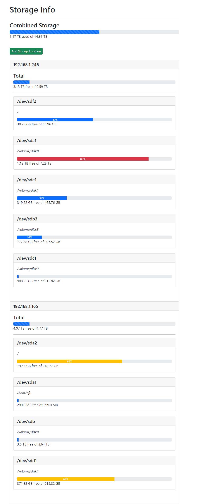

# df-web? (dfw)

Queries storage information from remote hosts using df and fabric, an ssh automation library with similar functionality to ansible. The information is viewed in a web interface which also shows total/aggregrate storage availability for each host.

## Requirements

* Python3
* SSH key auth configured on remote hosts (hosts and ssh settings can be configured in webdisk.py)
* Pip3 (See requirements.txt)

## Screenshots

